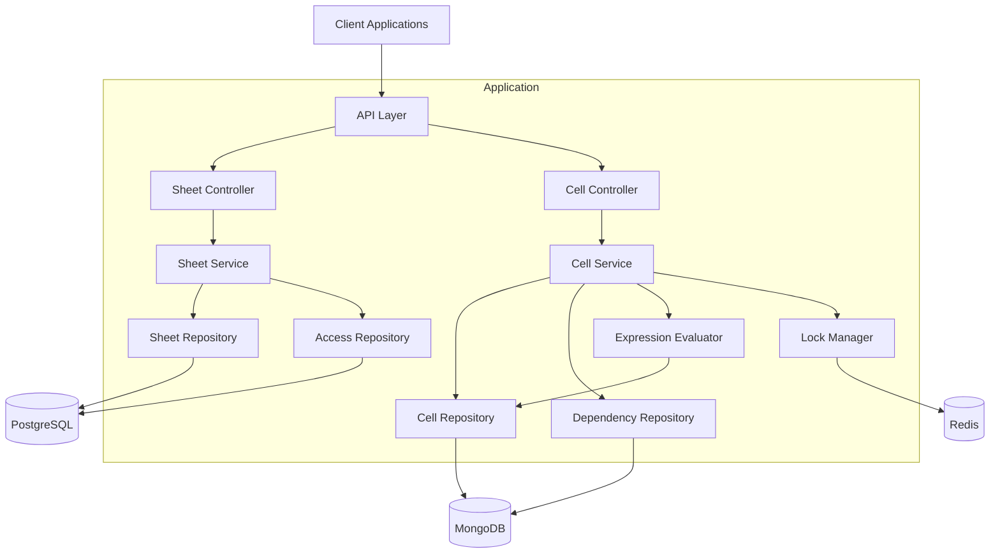

# High-Level Design (HLD) Document

## 1. Executive Summary

The Sheets project is an online collaborative spreadsheet application that enables users to create, share, and concurrently edit spreadsheets. The system supports cell-based operations with expression evaluation capabilities, similar to traditional spreadsheet applications but with a focus on concurrent editing and sharing capabilities.

The primary business objectives include:
- Providing a reliable, scalable platform for collaborative spreadsheet editing
- Supporting expression-based cell evaluation with dependency tracking
- Enabling fine-grained access control for sheet sharing
- Maintaining high performance (sub-100ms for writes, sub-200ms for reads)
- Supporting concurrent updates with proper locking mechanisms

The solution approach leverages a modern tech stack with Spring Boot, PostgreSQL for relational data, MongoDB for cell data, and Redis for caching and locking mechanisms to handle concurrent updates efficiently.

## 2. System Overview and Key Capabilities

### Current System Analysis
The codebase is in the early stages of development with the basic infrastructure set up. It includes a Spring Boot application with PostgreSQL and Redis integration, along with OpenAPI specification for API documentation.

### Problem Statement
Traditional spreadsheet applications lack effective collaboration features and struggle with concurrent editing. This system aims to solve these challenges by providing a scalable, high-performance online spreadsheet platform with concurrent editing capabilities while maintaining data consistency.

### Core Capabilities
- Sheet creation and management
- Cell-based data entry and manipulation
- Expression evaluation in cells
- Dependency tracking between cells
- Concurrent editing with locking mechanisms
- Sheet sharing with different access levels

### Key Features
- User management (authentication handled via headers)
- Sheet creation and management
- Cell data manipulation with expression support
- Dependency tracking between cells
- Concurrent editing with Redis-based locking
- Access control for shared sheets

### Technology Stack
| Component | Technology | Version | File/Location |
|-----------|------------|---------|--------------|
| Backend | Spring Boot | 3.5.0 | build.gradle.kts |
| Language | Kotlin | 1.9.25 | build.gradle.kts |
| Relational Database | PostgreSQL | 15 | docker-compose.yml |
| Document Database | MongoDB | (Planned) | requirements.md |
| Caching/Locking | Redis | 7 | docker-compose.yml |
| API Documentation | OpenAPI/Swagger | 3.0.3 | src/main/resources/openapi/api.yaml |
| ORM/Query | JOOQ | 3.19.3 | build.gradle.kts |
| Migration | Flyway | 9.16.1 | build.gradle.kts |
| Build Tool | Gradle | 7.1+ | build.gradle.kts |

### Architecture Patterns
- Layered architecture (Controller, Service, Repository)
- API-first development with OpenAPI
- Domain-driven design
- Dependency injection
- Repository pattern for data access
- DTO pattern for data transformation
- Strategy pattern for expression evaluation (planned)

## 3. Requirements Analysis

### 3.1 Functional Requirements

#### User Management
- User identification via X-User-ID header (no authentication implementation required)
- User profile management

#### Sheet Management
- Create new sheets with name and description
- List all sheets owned by or shared with a user
- View sheet details including cells
- Share sheets with other users with different access levels

#### Cell Management
- Add/update cell data (primitive values or expressions)
- Evaluate expressions in cells
- Track dependencies between cells
- Handle concurrent updates with Redis-based locking

### 3.2 Non-Functional Requirements

#### Performance
- 99th percentile latency for saving sheets < 100ms
- 99th percentile latency for retrieving sheet details < 200ms

#### Scalability
- Support for 10M records and 1M writes
- Up to 50 sheets per server
- Up to 10 concurrent updates on a sheet

#### Availability
- High availability for sheet data
- Resilient to failures

#### Security
- Access control for sheet operations
- User-based permissions

## 4. High-Level Architecture

### 4.1 System Architecture Diagram

### 4.2 Architecture Patterns

#### Current Patterns
- **Layered Architecture**: Clear separation between controllers, services, and repositories
- **API-First Development**: OpenAPI specifications define the API contract
- **Repository Pattern**: Abstraction for data access operations
- **DTO Pattern**: Separate data transfer objects for API communication
- **Mapper Pattern**: Conversion between domain models and DTOs

#### Planned Patterns for Extensibility
- **Strategy Pattern**: For different expression evaluation strategies
- **Observer Pattern**: For dependency tracking and updates
- **Factory Pattern**: For creating different cell types
- **Command Pattern**: For undo/redo operations (future extension)
- **Decorator Pattern**: For adding behavior to cells (future extension)

### 4.3 Data Architecture

#### Relational Data (PostgreSQL)
- User information
- Sheet metadata
- Access control mappings

#### Document Data (MongoDB)
- Cell data
- Cell dependencies

#### Cache and Locking (Redis)
- Distributed locks for concurrent cell updates
- Caching frequently accessed data
- Dependency tracking for quick access

## 5. Component Breakdown

### 5.1 System Components

#### Sheet Management
- **Purpose**: Manage sheet creation, retrieval, and sharing
- **Responsibilities**: 
  - Create and update sheets
  - List sheets for a user
  - Share sheets with other users
  - Manage access control
- **Interfaces**: 
  - POST /sheet/
  - GET /sheet/
  - GET /sheet/{sheetId}
  - POST /v1/sheet/share/{sheetId}

#### Cell Management
- **Purpose**: Manage cell data and expression evaluation
- **Responsibilities**:
  - Store and retrieve cell data
  - Evaluate expressions
  - Track dependencies between cells
  - Handle concurrent updates
- **Interfaces**:
  - POST /sheet/{sheetID}/cell/cellId

#### Expression Evaluation
- **Purpose**: Evaluate cell expressions
- **Responsibilities**:
  - Parse expressions
  - Evaluate expressions
  - Detect circular dependencies
  - Update dependent cells
- **Interfaces**: Internal service interfaces

#### Locking Mechanism
- **Purpose**: Handle concurrent updates
- **Responsibilities**:
  - Lock cells during updates
  - Prevent race conditions
  - Release locks after updates
- **Interfaces**: Internal service interfaces

### 5.2 API Design

#### Sheet Management APIs
- **POST /sheet/**: Create a new sheet
  - Request: Sheet name and description
  - Response: Sheet details
- **GET /sheet/**: Get all sheets for a user
  - Response: List of sheets
- **GET /sheet/{sheetId}**: Get sheet details
  - Response: Sheet details with cells
- **POST /v1/sheet/share/{sheetId}**: Share a sheet
  - Request: List of users and access type
  - Response: Share link

#### Cell Management APIs
- **POST /sheet/{sheetID}/cell/cellId**: Update cell data
  - Request: Cell value (primitive or expression)
  - Response: Updated cell value and calculated value

### 5.3 Integration Points

- **MongoDB**: For storing cell data
- **Redis**: For distributed locking and caching
- **PostgreSQL**: For relational data storage

## 6. Technology Choices

### 6.1 Current Technology Stack

| Component | Technology | Rationale |
|-----------|------------|-----------|
| Backend Framework | Spring Boot | Industry standard, robust, and well-supported |
| Programming Language | Kotlin | Modern, concise, and type-safe with excellent Java interoperability |
| Relational Database | PostgreSQL | Open-source, robust, and feature-rich RDBMS |
| Document Database | MongoDB (planned) | Flexible schema for cell data with good performance |
| Caching/Locking | Redis | Fast in-memory data store with distributed locking capabilities |
| API Documentation | OpenAPI/Swagger | Industry standard for API documentation |
| Database Access | JOOQ | Type-safe SQL query building |
| Database Migration | Flyway | Version-controlled database schema evolution |

### 6.2 Technology Analysis

- **Kotlin**: Chosen for its concise syntax, null safety, and extension functions
- **Spring Boot**: Provides a robust framework with dependency injection and auto-configuration
- **PostgreSQL**: Reliable relational database for structured data
- **MongoDB**: Flexible document database for cell data with varying structures
- **Redis**: High-performance in-memory store for caching and locking
- **JOOQ**: Type-safe SQL query building with code generation
- **Flyway**: Database migration tool for version-controlled schema evolution
- **OpenAPI**: API-first development approach with code generation

## 7. Scalability and Performance

### Scalability Approach
- Horizontal scaling of application servers
- Database sharding for large datasets
- Redis clustering for distributed caching and locking
- Asynchronous processing for non-critical operations

### Performance Optimization
- Caching frequently accessed data in Redis
- Optimized database queries with proper indexing
- Batch processing for bulk operations
- Efficient expression evaluation algorithms
- Optimistic locking for concurrent updates

### Potential Bottlenecks
- Expression evaluation for complex formulas
- Concurrent updates to the same sheet
- Dependency chain updates
- Database performance under high load

## 8. Extensibility Design

### Extensibility Principles
1. **Modular Architecture**: Components with well-defined interfaces
2. **Pluggable Components**: Easily replaceable implementations
3. **Interface-Based Design**: Programming to interfaces, not implementations
4. **Configuration Over Code**: Externalized configuration
5. **Open/Closed Principle**: Open for extension, closed for modification

### Extension Points

#### Expression Evaluation
- **Interface**: `ExpressionEvaluator`
- **Extensions**: Different expression languages, custom functions
- **Implementation**: Strategy pattern with pluggable evaluators

#### Cell Types
- **Interface**: `Cell`
- **Extensions**: New cell types (formula, chart, image)
- **Implementation**: Factory pattern with type registry

#### Storage Backends
- **Interface**: `CellRepository`, `SheetRepository`
- **Extensions**: Different database implementations
- **Implementation**: Repository interfaces with multiple implementations

#### Access Control
- **Interface**: `AccessControlService`
- **Extensions**: Different permission models
- **Implementation**: Strategy pattern with pluggable permission checkers

#### Notification System
- **Interface**: `NotificationService`
- **Extensions**: Email, push, in-app notifications
- **Implementation**: Observer pattern with multiple subscribers

### Versioning Strategy
- Semantic versioning for APIs
- Backward compatibility guarantees
- API versioning in URL paths
- Database schema versioning with Flyway

## 9. Security Implementation

### Authentication
- User identification via X-User-ID header
- No authentication implementation required as per requirements

### Authorization
- Role-based access control for sheets
- Access types: READ, WRITE, ADMIN
- Permission checking at service layer

### Data Protection
- Input validation for all API requests
- SQL injection protection via parameterized queries
- XSS protection via proper output encoding

## 10. Current System Assessment

### Code Quality
- Well-structured codebase with clear separation of concerns
- Consistent naming conventions
- Type-safe code with Kotlin

### Documentation Coverage
- OpenAPI specifications for API documentation
- Requirements documentation
- Missing detailed implementation documentation

### Testing Strategy
- Unit tests for business logic
- Integration tests for API endpoints
- Performance tests for critical operations

### Deployment Process
- Docker-based deployment with docker-compose
- Database migration with Flyway
- Missing CI/CD pipeline configuration
