# System Patterns

**Created:** 2025-05-24  
**Status:** [ACTIVE]  
**Author:** [Your Name]  
**Last Modified:** 2025-06-04 02:55
**Last Updated By:** Cascade AI Assistant

## Table of Contents
- [Architectural Overview](#architectural-overview)
- [System Components](#system-components)
- [Data Flow](#data-flow)
- [Database Schema](#database-schema)
- [Repository Pattern Implementation](#repository-pattern-implementation)
- [Cell Dependency Management](#cell-dependency-management)
- [Error Handling Pattern](#error-handling-pattern)
- [Testing Patterns](#testing-patterns)
- [Design Decisions](#design-decisions)
- [Cross-Cutting Concerns](#cross-cutting-concerns)
- [Scalability Considerations](#scalability-considerations)
- [Expression Evaluation System](#expression-evaluation-system)
- [Stress Testing Architecture](#stress-testing-architecture)

## Architectural Overview
The Sheets application follows a layered architecture pattern with clear separation between API, service, and repository layers. The application uses Spring Boot as the core framework with PostgreSQL for data persistence, MongoDB for document storage, and Redis for caching.

### Architecture Diagram
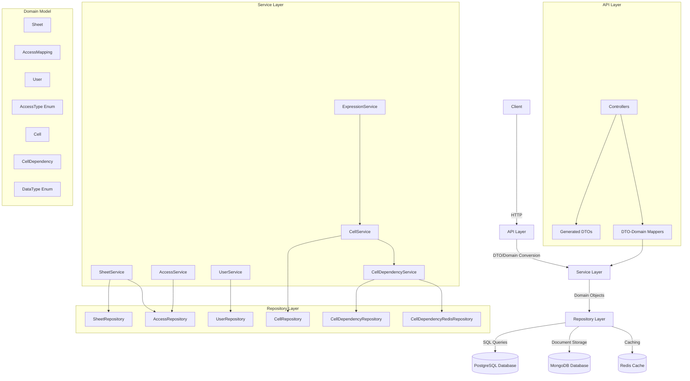

## System Components
### API Layer
- **Purpose:** Handles HTTP requests and responses
- **Responsibilities:**
  - Request validation
  - Response formatting
  - Error handling
  - DTO-to-domain model conversion
- **Components:**
  - Controllers
  - Generated DTOs from OpenAPI
  - Mappers between DTOs and domain models

### Service Layer
- **Purpose:** Implements business logic
- **Responsibilities:**
  - Business rule enforcement
  - Transaction management
  - Orchestration of repository calls
  - Domain model validation
- **Components:**
  - SheetServiceImpl
  - AccessServiceImpl
  - UserServiceImpl
  - CellServiceImpl
  - CellDependencyServiceImpl
  - ExpressionServiceImpl

### Repository Layer
- **Purpose:** Data access and persistence
- **Responsibilities:**
  - CRUD operations
  - Query execution
  - Type conversion between domain and database
  - Error handling for database operations
  - Caching strategies
- **Components:**
  - SheetRepositoryImpl
  - AccessRepositoryImpl
  - UserRepositoryImpl
  - CellRepositoryImpl
  - CellDependencyRepositoryImpl
  - CellDependencyRedisRepository

### Domain Model
- **Purpose:** Represents business entities and logic
- **Components:**
  - Sheet
  - AccessMapping
  - User
  - AccessType (Enum)
  - Cell
  - CellDependency
  - DataType (Enum)

## Database Schema
The database schema consists of three main tables in PostgreSQL: users, sheets, and access_mappings. Cell and CellDependency data is stored in MongoDB for flexibility.

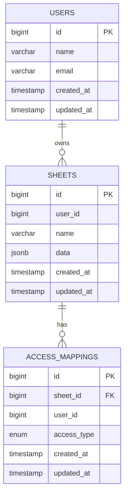

### MongoDB Collections
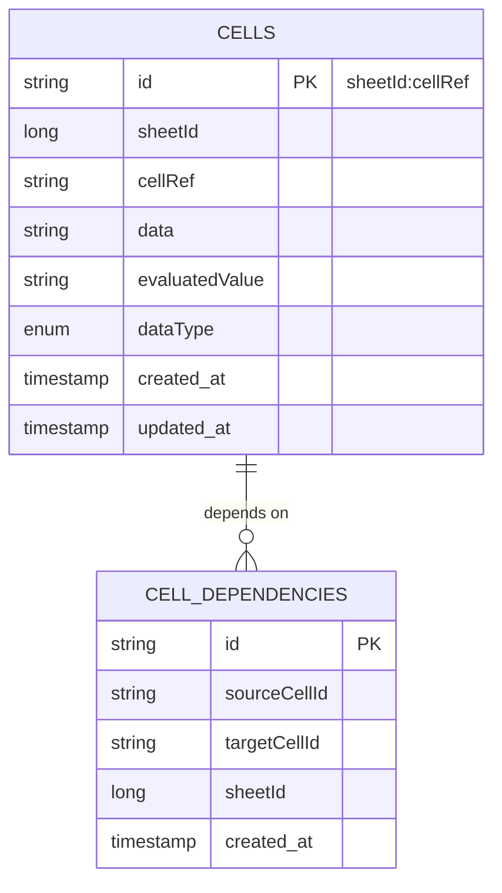

### Key Database Features
- **Custom Enum Type:** `access_type` with values 'READ', 'WRITE', 'ADMIN', 'OWNER'
- **Foreign Key Constraints:** Removed for development flexibility
- **Timestamps:** All tables include `created_at` and `updated_at` columns
- **Triggers:** Automatic update of `updated_at` column on record changes
- **MongoDB:** Used for storing cell data and dependencies for flexibility
- **Redis:** Used for caching cell dependencies for performance

## Repository Pattern Implementation
The repository layer implements the repository pattern with interfaces defining the contract and implementations providing the actual database interaction.


## Cell Dependency Management

### Cell Dependency Architecture
The cell dependency management system uses a dual-storage approach with MongoDB for persistence and Redis for caching.

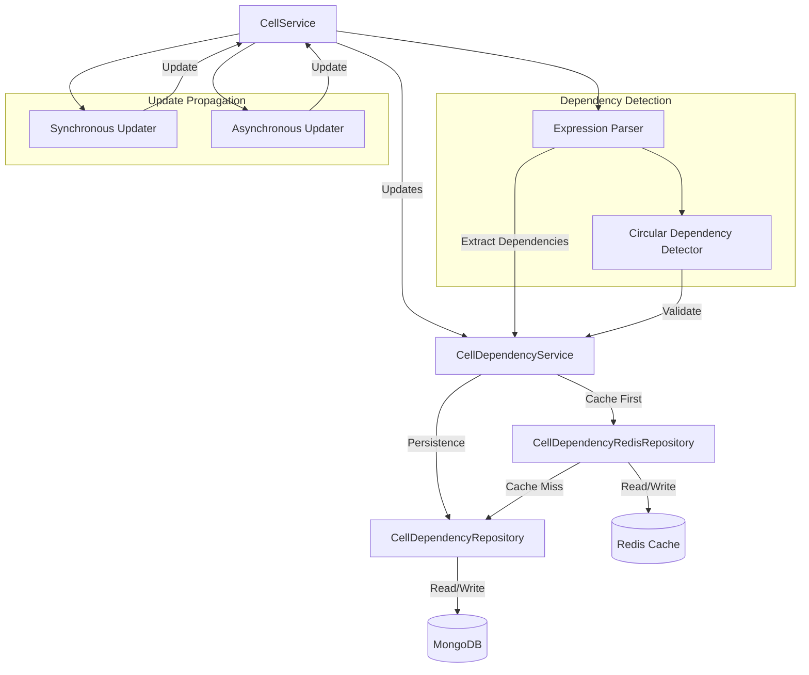

### Circular Dependency Detection
The system uses a depth-first search algorithm to detect circular dependencies in cell references.

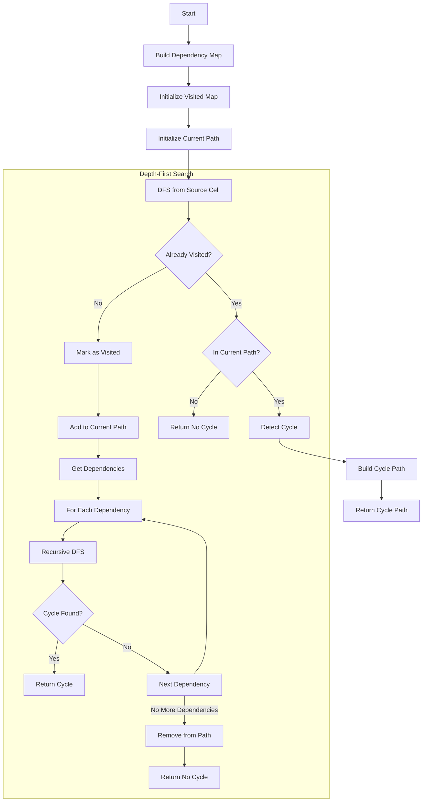

### Asynchronous Update Pattern
The system uses Spring's @Async annotation to update dependent cells asynchronously.

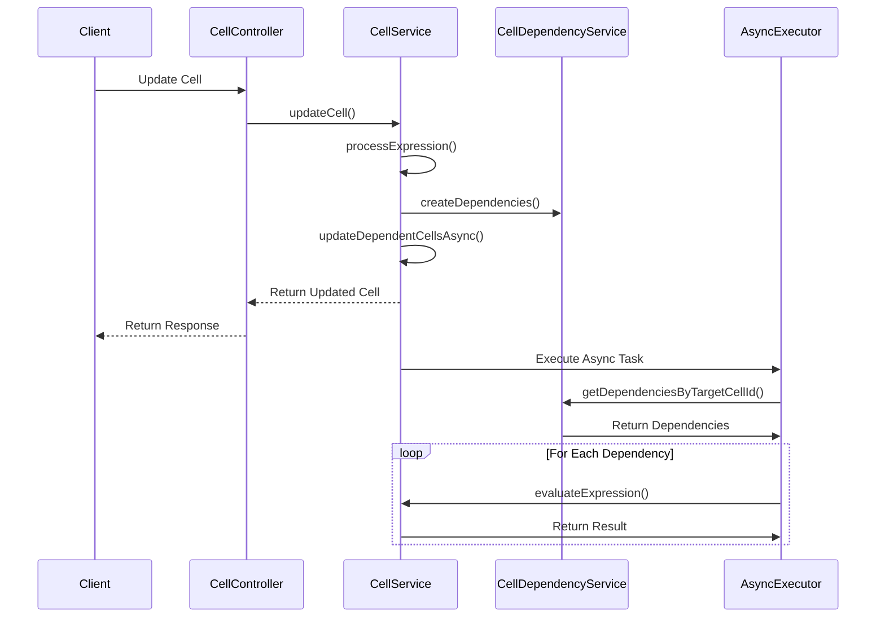

### Redis Caching Strategy
The system uses Redis for caching cell dependencies with a 24-hour TTL.

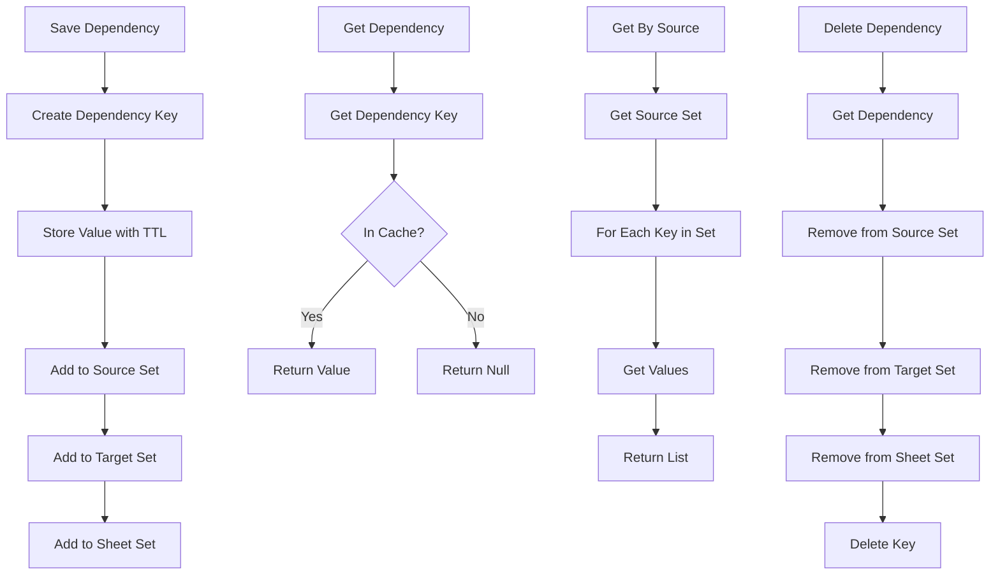

## Error Handling Pattern
### Custom Exception Hierarchy
To provide more granular and meaningful error messages, a custom exception hierarchy has been implemented. All custom exceptions inherit from a base `SheetException`.

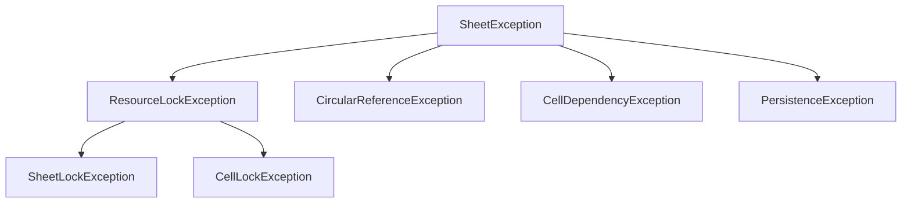

- **`SheetException`**: Base abstract class for all application-specific exceptions.
- **`ResourceLockException`**: Base class for exceptions related to resource locking, including `retryAfterMs` for client guidance.
- **`SheetLockException`**: Specific exception for conflicts when acquiring a sheet-level lock.
- **`CellLockException`**: Specific exception for conflicts when acquiring a cell-level lock.
- **`CircularReferenceException`**: Thrown when a circular dependency is detected in cell formulas.
- **`CellDependencyException`**: Thrown when an operation (e.g., cell deletion) is blocked due to existing cell dependencies.
- **`PersistenceException`**: Thrown for errors encountered during data persistence operations (e.g., Redis or MongoDB).

### Global Exception Handling
All custom exceptions, as well as standard Spring exceptions, are handled centrally by the `GlobalExceptionHandler`. This ensures a consistent error response format across the entire API.

- **Centralized Handling**: A single `@ControllerAdvice` class (`GlobalExceptionHandler`) intercepts all exceptions.
- **Standardized Response**: Errors are mapped to a consistent `ErrorResponse` model (defined in `api.yaml`), which includes `status`, `error`, `message`, `timestamp`, and a `details` field for additional context.
- **HTTP Status Mapping**: Exceptions are mapped to appropriate HTTP status codes (e.g., `409 Conflict` for lock errors, `400 Bad Request` for circular dependencies).
- **User-Friendly Messages**: Error responses include clear, actionable messages for the client.

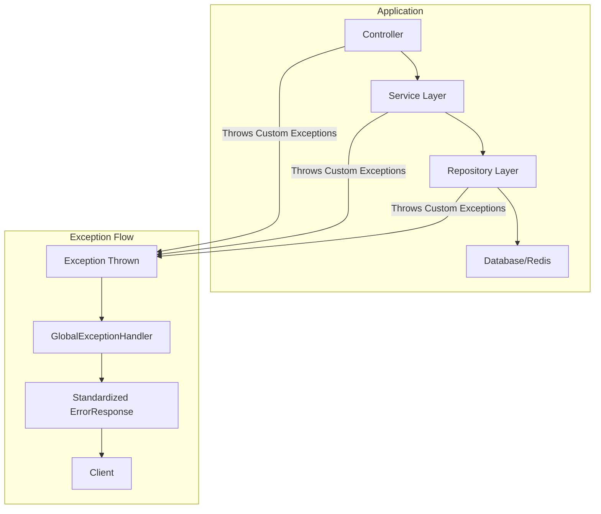

### Error Response Structure
The `ErrorResponse` model follows the OpenAPI specification defined in `api.yaml`:

```yaml
ErrorResponse:
  type: object
  properties:
    status:
      type: integer
      description: HTTP status code
      example: 400
    error:
      type: string
      description: Error type
      example: "Bad Request"
    message:
      type: string
      description: Error message
      example: "Invalid request parameters"
    path:
      type: string
      description: Request path
      example: "/v1/sheet"
    timestamp:
      type: string
      format: date-time
      description: Time when the error occurred
      example: "2025-06-04T00:30:00Z"
    details:
      type: object
      description: Additional error details specific to the error type
      additionalProperties: true
      example: {"resourceId": "1", "lockOwner": "user123", "retryAfterMs": 5000}
```

This pattern ensures that error handling is robust, consistent, and provides sufficient information for clients to understand and react to issues gracefully.

## Testing Patterns
The application follows a comprehensive testing strategy with a focus on unit tests, integration tests, and end-to-end tests. The testing approach uses MockK for mocking in Kotlin tests and follows the Arrange-Act-Assert pattern.

### Unit Testing Structure
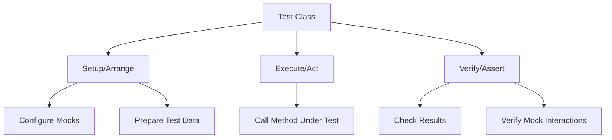

### Mock Configuration Patterns
When testing services with dependencies, the following patterns are used:

1. **Global Mocks Setup:**
   - Configure common mocks in the setUp() method
   - Set up default behaviors for frequently used dependencies
   - Initialize test data and fixtures

2. **Flexible Matchers:**
   - Use `any()` matchers instead of exact object matching to avoid type mismatch issues
   - Employ `slot` capture for complex object verification
   - Use `match { }` for custom matching logic

3. **Verification Strategy:**
   - Focus on essential operations in verifications
   - Verify end results rather than implementation details
   - Use ordered verification only when sequence matters

### A1 Notation Testing Considerations
When testing components that use A1 notation, special care is needed for:

1. **Cell ID Format:**
   - Cell IDs follow the format `sheetId:row:column` where column is an alphabetical letter (e.g., "1:1:A")
   - Helper methods must correctly extract sheet ID and cell coordinates
   - Test data must use consistent A1 notation format

2. **Type Handling:**
   - Ensure proper type handling for timestamps (Instant vs. String)
   - Use appropriate type converters in test setup
   - Handle type coercion in mock expectations

3. **Dependency Mocking:**
   - Mock both source and target cell dependencies
   - Ensure proper handling of dependency creation and deletion
   - Use empty lists for dependencies when appropriate to simplify tests

### Test Data Generation
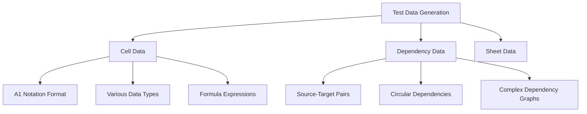

## Design Decisions
### Repository Pattern
- **Decision:** Use repository interfaces with multiple implementations
- **Rationale:** Enables swapping out data storage implementations without changing service layer
- **Implementation:** Each repository has a contract defined by an interface and one or more implementations

### Caching Strategy
- **Decision:** Use Redis for caching with TTL-based expiration
- **Rationale:** Provides fast access to frequently used data while ensuring eventual consistency
- **Implementation:** Cache-aside pattern with Redis as the cache and MongoDB as the source of truth

### Asynchronous Processing
- **Decision:** Use Spring's @Async for non-blocking operations
- **Rationale:** Improves user experience by returning responses quickly while processing continues in background
- **Implementation:** Async methods for dependent cell updates with proper exception handling

### Circular Dependency Detection
- **Decision:** Use depth-first search for cycle detection
- **Rationale:** Efficiently detects cycles in dependency graphs before evaluation
- **Implementation:** DFS algorithm that tracks visited nodes and current path

## Cross-Cutting Concerns
### Error Handling
- **Repository Layer:** Catches database exceptions and translates to domain exceptions
- **Service Layer:** Handles business logic exceptions and provides meaningful error messages
- **Dependency Management:** Logs dependency creation, updates, and circular dependency detection

### Logging
- **Repository Layer:** Logs method entry/exit, parameters, and results
- **Service Layer:** Logs business operations and decisions
- **Dependency Management:** Logs dependency creation, updates, and circular dependency detection

### Performance Optimization
- **Caching:** Redis caching for frequently accessed dependencies
- **Asynchronous Processing:** Background processing for dependent cell updates
- **Batch Operations:** Batch saving of dependencies for better performance

## Scalability Considerations
### Horizontal Scaling
- **Stateless Services:** All services are stateless and can be horizontally scaled
- **Redis Clustering:** Redis can be configured for clustering to handle increased load
- **MongoDB Sharding:** MongoDB collections can be sharded for horizontal scaling

### Performance Bottlenecks
- **Large Dependency Graphs:** May require optimization for spreadsheets with many dependencies
- **Circular Dependency Detection:** Algorithm complexity increases with dependency graph size
- **Redis Memory Usage:** Monitoring needed for Redis memory usage with large number of dependencies

## Expression Evaluation System
The expression evaluation system is responsible for parsing and evaluating formulas in cells. It supports arithmetic operations, function calls, cell references, and cell ranges.

### Expression Evaluation Flow
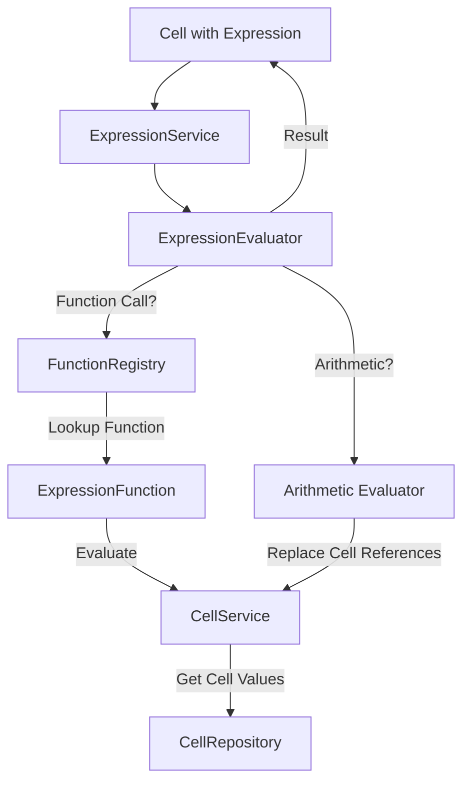

### Alphabetical Column Notation (A1 Style)
The system uses alphabetical column notation (A1 style) for cell references, which is the industry standard for spreadsheet applications. This notation uses letters for columns (A, B, C, ..., Z, AA, AB, ...) and numbers for rows (1, 2, 3, ...).

#### Cell Reference Format
```
[Column Letter][Row Number]
```
Examples: A1, B2, C3, AA10, etc.

#### Cell Range Format
```
[Start Cell]:[End Cell]
```
Examples: A1:C3, B2:D5, etc.

#### Implementation Details
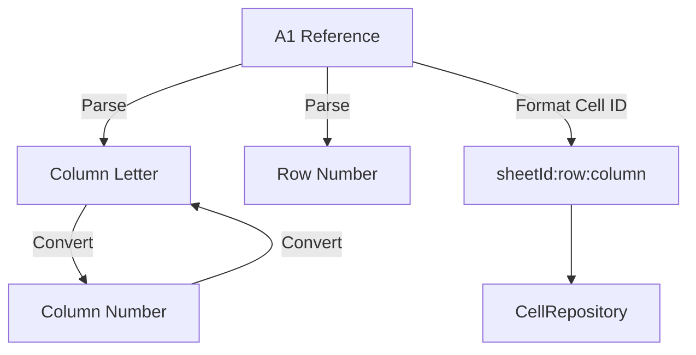

#### Conversion Functions
The system includes utility functions to convert between column letters and column numbers:

1. **Column Letter to Number**:
   ```kotlin
   fun columnLetterToNumber(columnLetter: String): Int {
       var result = 0
       for (c in columnLetter) {
           result = result * 26 + (c - 'A' + 1)
       }
       return result
   }
   ```

2. **Column Number to Letter**:
   ```kotlin
   fun numberToColumnLetter(columnNumber: Int): String {
       var dividend = columnNumber
       var columnName = ""
       
       while (dividend > 0) {
           val modulo = (dividend - 1) % 26
           columnName = (modulo + 'A'.code).toChar() + columnName
           dividend = (dividend - modulo) / 26
       }
       
       return columnName
   }
   ```

### Expression Functions
The system supports various expression functions for formula evaluation. Each function implements the `ExpressionFunction` interface and is registered with the `FunctionRegistry`.

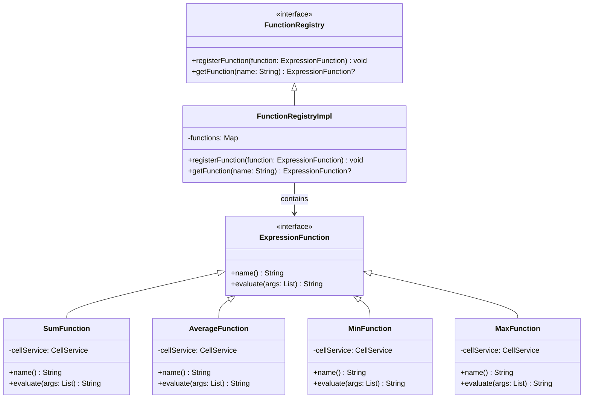

#### Function Evaluation Process
Each expression function follows a similar pattern for evaluating cell references and ranges:

1. Extract sheetId from arguments if provided
2. Process each argument:
   - If it's a direct number, use it as is
   - If it's an A1 notation cell reference (e.g., A1), look up the cell value
   - If it's an A1 notation range (e.g., A1:C3), process all cells in the range
   - If it's a legacy numeric reference (e.g., 1:1), convert to A1 notation and look up the cell value
   - If it's a legacy numeric range (e.g., 1:1-3:3), convert to A1 notation and process all cells in the range
3. Apply the function logic to the collected values
4. Return the result as a string

### Arithmetic Expression Evaluation
Arithmetic expressions are evaluated using a tokenizer and operator precedence logic. The system supports standard operators (+, -, *, /, parentheses) and cell references.

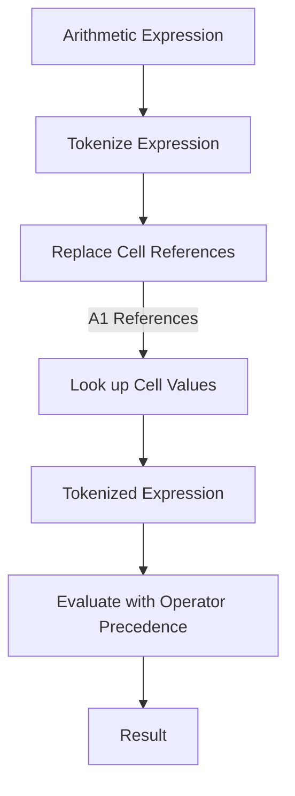

#### Cell Reference Replacement
Before evaluating an arithmetic expression, all cell references are replaced with their actual values:

```kotlin
private fun evaluateArithmeticExpression(expression: String, context: Map<String, String>): String {
    var processedExpression = expression
    val a1Pattern = "([A-Z]+)(\\d+)".toRegex()
    val a1Matches = a1Pattern.findAll(processedExpression)
    
    for (match in a1Matches) {
        val cellRef = match.value
        if (cellRef in context) {
            val value = context[cellRef] ?: "0"
            processedExpression = processedExpression.replace(cellRef, value)
        } else {
            processedExpression = processedExpression.replace(cellRef, "0")
        }
    }
    
    // Evaluate the processed expression using tokenizer and operator precedence
    // ...
}

```

## Stress Testing Architecture
The application includes a comprehensive stress testing framework using Gatling to validate API behavior under load and concurrent access scenarios.

### Stress Test Architecture
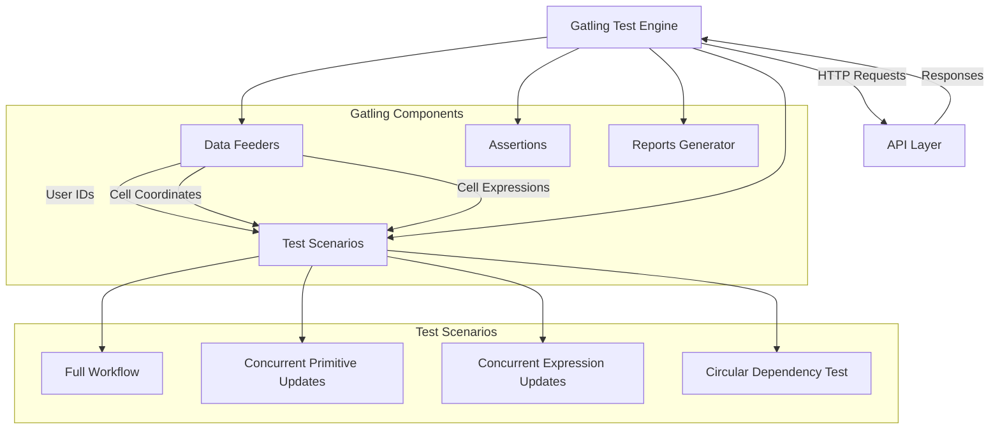

### Stress Test Components
- **Gatling Engine**: Core test execution engine that manages scenarios, feeders, and HTTP requests
- **Test Scenarios**: Defined workflows that simulate user behavior
  - **Full Workflow**: Basic end-to-end flow covering sheet creation, cell updates, retrieval, and deletion
  - **Concurrent Primitive Updates**: Tests concurrent updates to the same cells with primitive values
  - **Concurrent Expression Updates**: Tests concurrent updates to cells with expressions that reference other cells
  - **Circular Dependency Test**: Tests system behavior when circular dependencies are created
- **Feeders**: Data providers that generate test data
  - **User ID Feeder**: Provides consistent user IDs for proper access control
  - **Cell Coordinate Feeder**: Generates random cell coordinates and data
  - **Fixed Cell Feeder**: Provides a limited set of cell coordinates to force concurrent updates
  - **Expression Feeder**: Generates random cell expressions using A1 notation
- **Assertions**: Validates response status codes and content
- **Reports Generator**: Creates detailed HTML reports with performance metrics

### Stress Test Data Flow
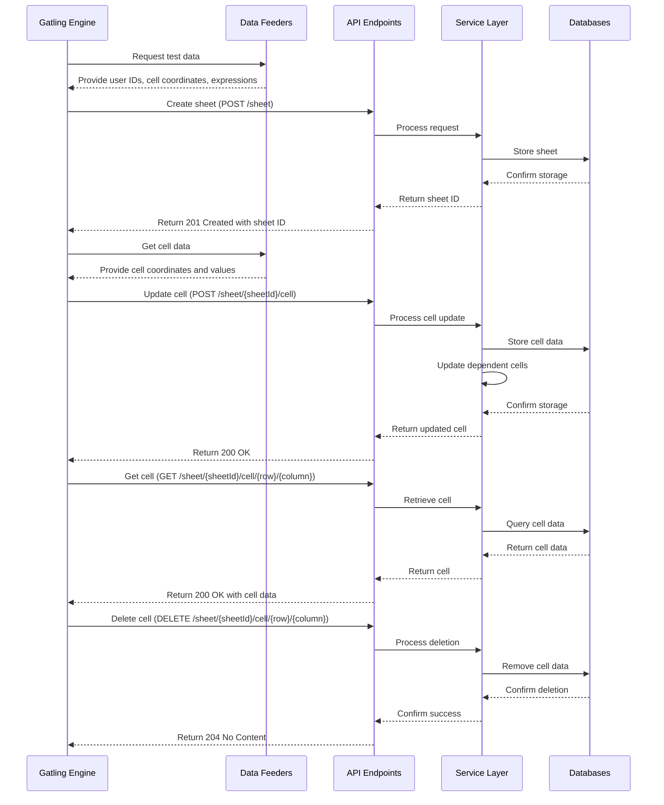

### Concurrency Test Pattern
The stress test implements a specific pattern to test concurrent updates to the same resources:

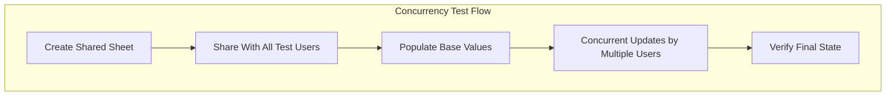

1. **Create Shared Sheet**: A single sheet is created that will be accessed by all test users
2. **Share With All Users**: The sheet is explicitly shared with all test users with WRITE access
3. **Populate Base Values**: Initial values are set in cells that will be concurrently updated
4. **Concurrent Updates**: Multiple users (20+) simultaneously update the same set of cells
5. **Verify Final State**: The final state of the cells is retrieved and verified

This pattern effectively tests:
- Locking mechanisms for concurrent cell updates
- Race conditions in cell value updates
- Expression evaluation with changing dependencies
- Conflict resolution in the API layer

### Circular Dependency Test Pattern
The stress test includes a specific scenario to test circular dependency detection:

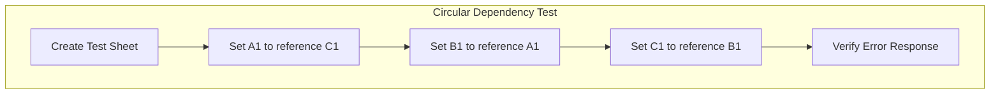

1. **Create Test Sheet**: A dedicated sheet is created for circular dependency testing
2. **Set A1 to reference C1**: Cell A1 is set to `=C1+1`
3. **Set B1 to reference A1**: Cell B1 is set to `=A1+1`
4. **Set C1 to reference B1**: Cell C1 is set to `=B1+1`, creating a circular dependency (A1→C1→B1→A1)
5. **Verify Error Response**: The system should detect the circular dependency and return an appropriate error

This pattern tests the system's ability to detect and handle circular dependencies in cell expressions.

{{ ... }}
