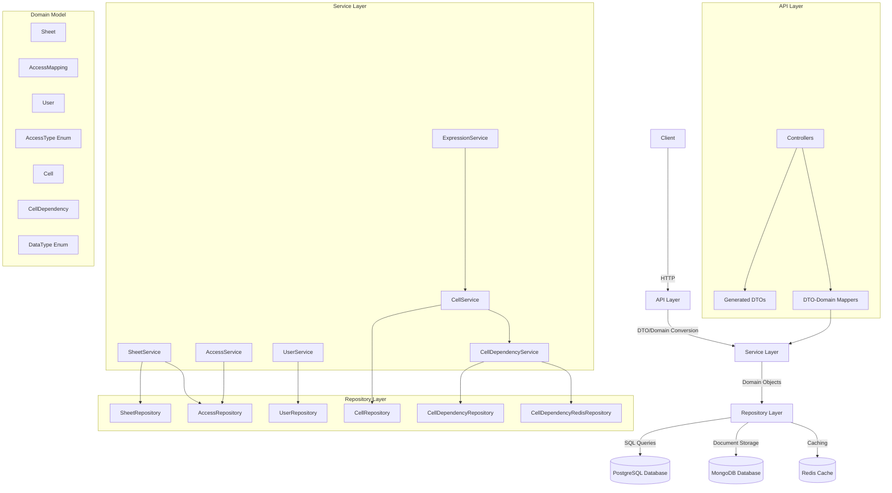
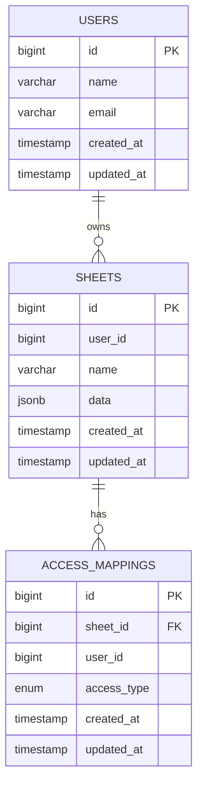
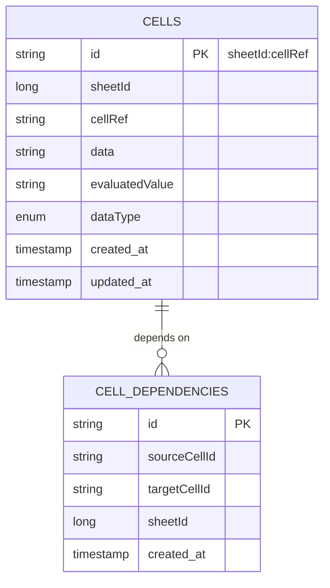
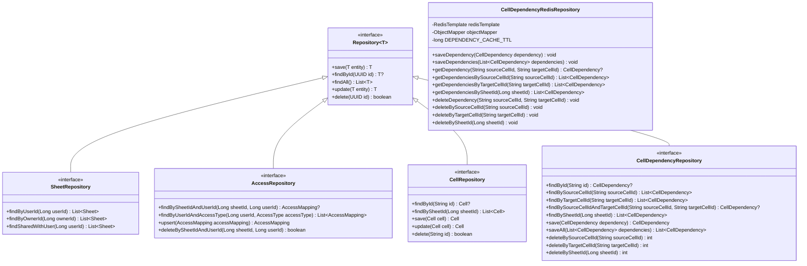
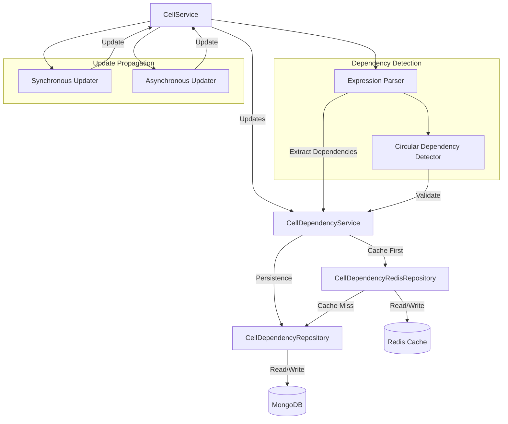
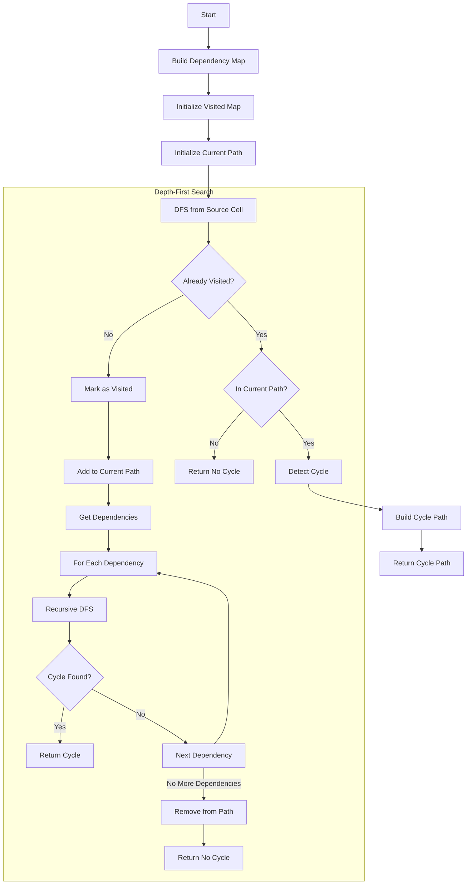
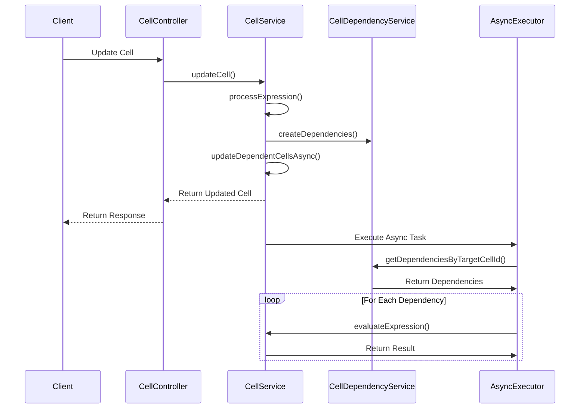
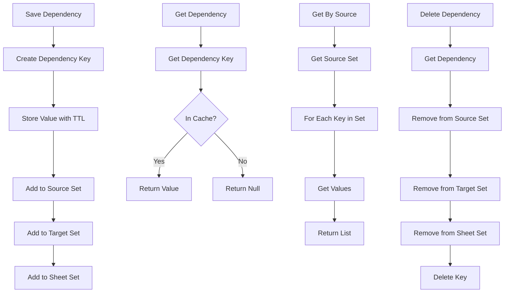

# System Patterns

**Created:** 2025-05-24  
**Status:** [ACTIVE]  
**Author:** [Your Name]  
**Last Modified:** 2025-06-02
**Last Updated By:** Cascade AI Assistant

## Table of Contents
- [Architectural Overview](#architectural-overview)
- [System Components](#system-components)
- [Data Flow](#data-flow)
- [Database Schema](#database-schema)
- [Repository Pattern Implementation](#repository-pattern-implementation)
- [Cell Dependency Management](#cell-dependency-management)
- [Design Decisions](#design-decisions)
- [Cross-Cutting Concerns](#cross-cutting-concerns)
- [Scalability Considerations](#scalability-considerations)

## Architectural Overview
The Sheets application follows a layered architecture pattern with clear separation between API, service, and repository layers. The application uses Spring Boot as the core framework with PostgreSQL for data persistence, MongoDB for document storage, and Redis for caching.

### Architecture Diagram

## System Components
### API Layer
- **Purpose:** Handles HTTP requests and responses
- **Responsibilities:**
  - Request validation
  - Response formatting
  - Error handling
  - DTO-to-domain model conversion
- **Components:**
  - Controllers
  - Generated DTOs from OpenAPI
  - Mappers between DTOs and domain models

### Service Layer
- **Purpose:** Implements business logic
- **Responsibilities:**
  - Business rule enforcement
  - Transaction management
  - Orchestration of repository calls
  - Domain model validation
- **Components:**
  - SheetServiceImpl
  - AccessServiceImpl
  - UserServiceImpl
  - CellServiceImpl
  - CellDependencyServiceImpl
  - ExpressionServiceImpl

### Repository Layer
- **Purpose:** Data access and persistence
- **Responsibilities:**
  - CRUD operations
  - Query execution
  - Type conversion between domain and database
  - Error handling for database operations
  - Caching strategies
- **Components:**
  - SheetRepositoryImpl
  - AccessRepositoryImpl
  - UserRepositoryImpl
  - CellRepositoryImpl
  - CellDependencyRepositoryImpl
  - CellDependencyRedisRepository

### Domain Model
- **Purpose:** Represents business entities and logic
- **Components:**
  - Sheet
  - AccessMapping
  - User
  - AccessType (Enum)
  - Cell
  - CellDependency
  - DataType (Enum)

## Database Schema
The database schema consists of three main tables in PostgreSQL: users, sheets, and access_mappings. Cell and CellDependency data is stored in MongoDB for flexibility.

### MongoDB Collections

### Key Database Features
- **Custom Enum Type:** `access_type` with values 'READ', 'WRITE', 'ADMIN', 'OWNER'
- **Foreign Key Constraints:** Removed for development flexibility
- **Timestamps:** All tables include `created_at` and `updated_at` columns
- **Triggers:** Automatic update of `updated_at` column on record changes
- **MongoDB:** Used for storing cell data and dependencies for flexibility
- **Redis:** Used for caching cell dependencies for performance

## Repository Pattern Implementation
The repository layer implements the repository pattern with interfaces defining the contract and implementations providing the actual database interaction.

## Cell Dependency Management

### Cell Dependency Architecture
The cell dependency management system uses a dual-storage approach with MongoDB for persistence and Redis for caching.

### Circular Dependency Detection
The system uses a depth-first search algorithm to detect circular dependencies in cell references.

### Asynchronous Update Pattern
The system uses Spring's @Async annotation to update dependent cells asynchronously.

### Redis Caching Strategy
The system uses Redis for caching cell dependencies with a 24-hour TTL.

## Design Decisions
### Repository Pattern
- **Decision:** Use repository interfaces with multiple implementations
- **Rationale:** Enables swapping out data storage implementations without changing service layer
- **Implementation:** Each repository has a contract defined by an interface and one or more implementations

### Caching Strategy
- **Decision:** Use Redis for caching with TTL-based expiration
- **Rationale:** Provides fast access to frequently used data while ensuring eventual consistency
- **Implementation:** Cache-aside pattern with Redis as the cache and MongoDB as the source of truth

### Asynchronous Processing
- **Decision:** Use Spring's @Async for non-blocking operations
- **Rationale:** Improves user experience by returning responses quickly while processing continues in background
- **Implementation:** Async methods for dependent cell updates with proper exception handling

### Circular Dependency Detection
- **Decision:** Use depth-first search for cycle detection
- **Rationale:** Efficiently detects cycles in dependency graphs before evaluation
- **Implementation:** DFS algorithm that tracks visited nodes and current path

## Cross-Cutting Concerns
### Error Handling
- **Repository Layer:** Catches database exceptions and translates to domain exceptions
- **Service Layer:** Handles business logic exceptions and provides meaningful error messages
- **Controller Layer:** Converts exceptions to HTTP status codes and error messages

### Logging
- **Repository Layer:** Logs method entry/exit, parameters, and results
- **Service Layer:** Logs business operations and decisions
- **Dependency Management:** Logs dependency creation, updates, and circular dependency detection

### Performance Optimization
- **Caching:** Redis caching for frequently accessed dependencies
- **Asynchronous Processing:** Background processing for dependent cell updates
- **Batch Operations:** Batch saving of dependencies for better performance

## Scalability Considerations
### Horizontal Scaling
- **Stateless Services:** All services are stateless and can be horizontally scaled
- **Redis Clustering:** Redis can be configured for clustering to handle increased load
- **MongoDB Sharding:** MongoDB collections can be sharded for horizontal scaling

### Performance Bottlenecks
- **Large Dependency Graphs:** May require optimization for spreadsheets with many dependencies
- **Circular Dependency Detection:** Algorithm complexity increases with dependency graph size
- **Redis Memory Usage:** Monitoring needed for Redis memory usage with large number of dependencies
