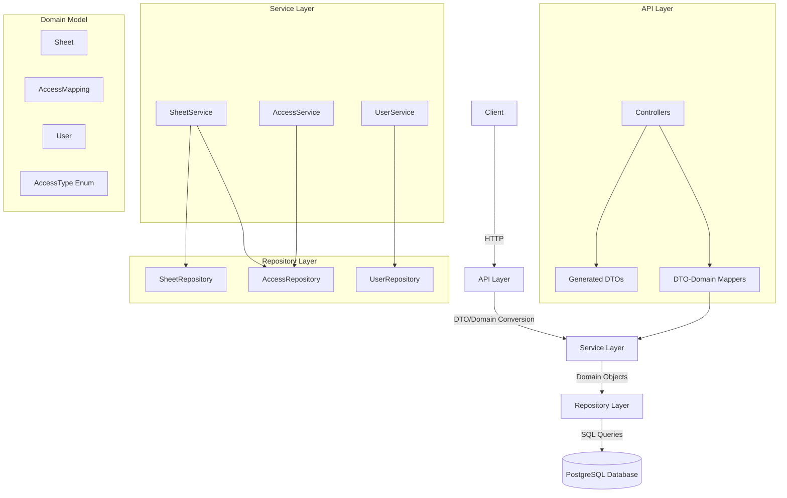
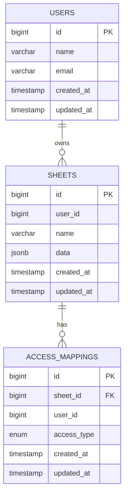
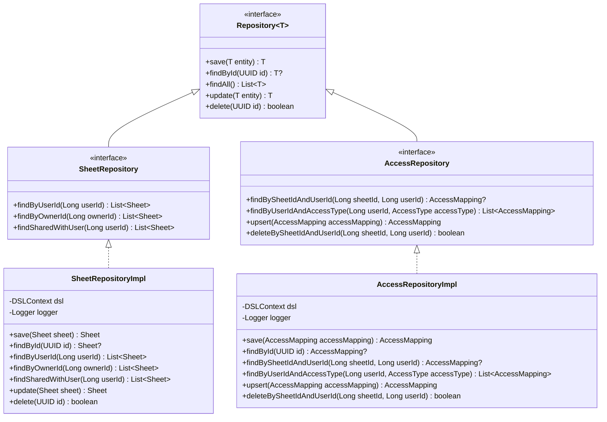

# System Patterns

**Created:** 2025-05-24  
**Status:** [ACTIVE]  
**Author:** [Your Name]  
**Last Modified:** 2025-06-02
**Last Updated By:** Cascade AI Assistant

## Table of Contents
- [Architectural Overview](#architectural-overview)
- [System Components](#system-components)
- [Data Flow](#data-flow)
- [Database Schema](#database-schema)
- [Repository Pattern Implementation](#repository-pattern-implementation)
- [Design Decisions](#design-decisions)
- [Cross-Cutting Concerns](#cross-cutting-concerns)
- [Scalability Considerations](#scalability-considerations)

## Architectural Overview
The Sheets application follows a layered architecture pattern with clear separation between API, service, and repository layers. The application uses Spring Boot as the core framework with PostgreSQL for data persistence.

### Architecture Diagram

## System Components
### API Layer
- **Purpose:** Handles HTTP requests and responses
- **Responsibilities:**
  - Request validation
  - Response formatting
  - Error handling
  - DTO-to-domain model conversion
- **Components:**
  - Controllers
  - Generated DTOs from OpenAPI
  - Mappers between DTOs and domain models

### Service Layer
- **Purpose:** Implements business logic
- **Responsibilities:**
  - Business rule enforcement
  - Transaction management
  - Orchestration of repository calls
  - Domain model validation
- **Components:**
  - SheetServiceImpl
  - AccessServiceImpl
  - UserServiceImpl

### Repository Layer
- **Purpose:** Data access and persistence
- **Responsibilities:**
  - CRUD operations
  - Query execution
  - Type conversion between domain and database
  - Error handling for database operations
- **Components:**
  - SheetRepositoryImpl
  - AccessRepositoryImpl
  - UserRepositoryImpl

### Domain Model
- **Purpose:** Represents business entities and logic
- **Components:**
  - Sheet
  - AccessMapping
  - User
  - AccessType (Enum)

## Database Schema
The database schema consists of three main tables: users, sheets, and access_mappings.

### Key Database Features
- **Custom Enum Type:** `access_type` with values 'READ', 'WRITE', 'ADMIN', 'OWNER'
- **Foreign Key Constraints:** Removed for development flexibility
- **Timestamps:** All tables include `created_at` and `updated_at` columns
- **Triggers:** Automatic update of `updated_at` column on record changes

## Repository Pattern Implementation
The repository layer implements the repository pattern with interfaces defining the contract and implementations providing the actual database interaction.

### Key Repository Implementation Features
- **Type Conversion:** Handling UUID in domain model vs BIGINT in database
- **Enum Handling:** Explicit casting of string values to PostgreSQL enum types
- **Error Handling:** Robust exception handling with detailed error messages
- **Logging:** Comprehensive logging of method entry/exit and error conditions

## Data Flow
### Sheet Creation Flow
1. Client sends HTTP request to create a sheet
2. Controller validates request and converts DTO to domain model
3. Service layer applies business rules and calls repository
4. Repository generates SQL query and executes it against the database
5. Repository converts database result to domain model
6. Service layer processes the result
7. Controller converts domain model to DTO and returns response

### Access Management Flow
1. Client sends HTTP request to share a sheet
2. Controller validates request and converts DTO to domain model
3. Service layer checks access permissions
4. Service layer calls repository to create/update access mapping
5. Repository handles type conversion and enum casting
6. Repository executes SQL query against the database
7. Service layer processes the result
8. Controller converts domain model to DTO and returns response

## Design Decisions
### UUID vs BIGINT for IDs
**Date:** 2025-06-02  
**Status:** Approved  
**Context:** Domain models use UUID for IDs while database uses BIGINT for some tables  
**Decision:** Handle conversion between UUID and BIGINT in repository layer  
**Rationale:** Maintain type safety in domain model while preserving existing database schema  
**Consequences:** Additional conversion logic required in repository implementations  
**Alternatives Considered:** Changing database schema to use UUID, changing domain model to use BIGINT

### PostgreSQL Enum Type Handling
**Date:** 2025-06-02  
**Status:** Approved  
**Context:** PostgreSQL enum `access_type` missing the `OWNER` value present in Kotlin `AccessType` enum  
**Decision:** Create migration to recreate the enum type with all values including `OWNER`  
**Rationale:** Align database enum type with domain model to avoid runtime errors  
**Consequences:** Requires explicit casting in SQL queries using `?::access_type` syntax  
**Alternatives Considered:** Using string type instead of enum, creating a mapping layer

### Foreign Key Constraints
**Date:** 2025-06-02  
**Status:** Approved  
**Context:** Foreign key constraints causing errors with non-existent user IDs  
**Decision:** Remove foreign key constraints for development flexibility  
**Rationale:** Enable testing and development without requiring user creation first  
**Consequences:** Reduced data integrity guarantees but increased flexibility  
**Alternatives Considered:** Creating test users, mocking repository layer for tests

## Cross-Cutting Concerns
### Error Handling
- **Repository Layer:** Catches specific exceptions, logs detailed error information, and rethrows with context
- **Service Layer:** Handles business logic exceptions and translates to appropriate responses
- **Controller Layer:** Converts exceptions to HTTP status codes and error messages

### Logging
- **Repository Layer:** Logs method entry/exit, parameters, and results
- **Service Layer:** Logs business operations and decisions
- **Controller Layer:** Logs incoming requests and responses

### Type Conversion
- **UUID to BIGINT:** Conversion between domain model IDs and database IDs
- **Enum Handling:** Explicit casting of string values to PostgreSQL enum types
- **Timestamp Conversion:** Proper handling of database timestamps and Kotlin LocalDateTime

## Scalability Considerations
### Database Scalability
- **Connection Pooling:** HikariCP for efficient connection management
- **Query Optimization:** Indexes on frequently queried columns
- **Transaction Management:** Proper transaction boundaries to avoid long-running transactions

### Application Scalability
- **Stateless Design:** No session state stored in application
- **Caching Strategy:** Not yet implemented
- **Horizontal Scaling:** Application designed to be horizontally scalable
